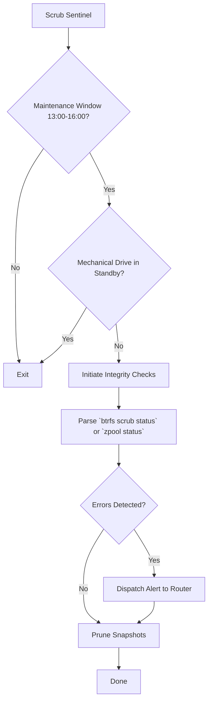

# Automated ZFS/Btrfs Snapshot Scrub & Integrity Sentinel

Coordinates scheduled filesystem scrubs and atomic snapshot retention across NVMe pool (`/volume2`) and HDD pool (`/volume1`) on UGREEN NAS.

## Architecture

## Storage Tiering Directives
* **NVMe Pool (`/volume2`)**: 7 daily snapshots.
* **HDD Pool (`/volume1`)**: 30 daily snapshots.

## Bit Rot Detection
The tool parses outputs from native storage utilities (`btrfs scrub status` and `zpool status`).
For Btrfs, it searches for uncorrectable errors and checksum mismatch strings.
For ZFS, it inspects the CKSUM column of `zpool status` output to detect any non-zero values indicative of bit rot.

## Scheduling Safeguards
Scrubs on mechanical HDDs must **never** wake sleeping drives randomly.
The sentinel only executes operations during the designated maintenance window (13:00-16:00) and aggressively checks if drives are in standby via `smartctl -n standby`. If the drive is sleeping, the tool aborts to save power and extend drive life.
