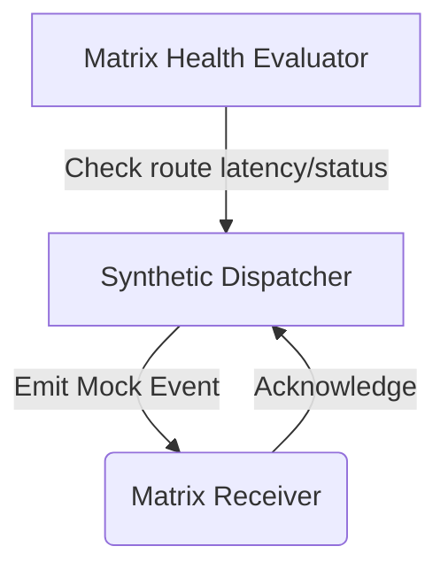

# Project 80: Homelab Synthetic Webhook Dispatcher & Health Matrix

This project is a synthetic webhook testing and verification engine that ensures webhooks dispatched between various homelab services (Sonarr, Radarr, Audiobookshelf, Plex, Notification Router) are received, validated, and processed reliably.

## Architecture

The system operates in dry-run or isolated test endpoints without modifying production library state. It uses an isolated containerized Python utility.



## Features

1. **Synthetic Dispatcher:** Emits mock event payloads (e.g. `DownloadCompleted`, `Grab`, `ScanComplete`) with HMAC signing.
2. **Matrix Receiver:** Listens on port 8095 to record incoming webhooks and measures end-to-end event propagation latency.
3. **Matrix Health Evaluator:** Verifies that every configured webhook route responds with 2xx within 500ms.

## Supported Event Schemas

All events follow this basic schema:

```json
{
  "eventId": "uuid",
  "eventType": "string",
  "data": { ... },
  "_dispatched_at": 1693526312.123
}
```

Events are signed using `X-Hub-Signature-256` header with an HMAC SHA-256 hash.

## Latency Benchmarking

Use the provided CLI flags to evaluate routes:

```bash
python webhook_matrix.py --test-route "MyRoute,http://localhost:8095" --json
```

The output will include the `latency_ms` and whether the route is `healthy` (latency <= 500ms and 2xx status code).
