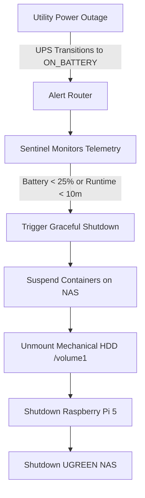

# Project 81: Homelab Automated Power Outage & UPS Battery Sentinel

## Overview
Monitors uninterruptible power supply (UPS) telemetry via Network UPS Tools (NUT) across homelab infrastructure (UGREEN NAS `192.168.1.80`, Raspberry Pi 5 `192.168.1.92`) to orchestrate graceful multi-node shutdowns during prolonged utility outages.

## Architecture & Shutdown Cascade



## Battery Buffer Thresholds
- **Charge:** < 25%
- **Runtime:** < 10 minutes (600 seconds)

## NUT Client Configuration
The sentinel operates as a containerized zero-mutation Python utility communicating with the NUT server over port `3493`.
- By default, looks for a UPS listed via the `LIST UPS` command.
- Queries `battery.charge`, `battery.runtime`, `ups.status`, `ups.load` using `GET VAR <upsname> <varname>`.

## Running the Container
```bash
docker-compose up -d
```
Metrics are exported to Prometheus on port `9113`.
