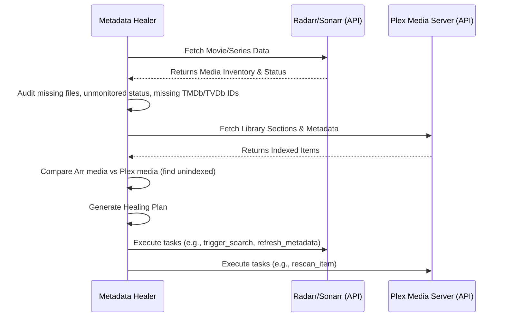

# Automated Plex/Arr Stack Media Metadata Healer

The **Metadata Healer** is a zero-host-mutation, isolated containerized Python utility designed to audit media libraries in Sonarr, Radarr, and Plex. It discovers unmapped movies/episodes, missing artwork, corrupted metadata matches, and duplicate file entries while ensuring non-destructive and strict API-first operations.

By prioritizing database and REST APIs, this ecosystem bypasses disk traversal completely—preventing the wakeup of mechanical HDDs (e.g., `/volume1`), saving power, and prolonging disk lifespans.

## Architecture & Workflow

The architecture comprises three primary modules:
1. **Media Auditor**: Connects to Radarr and Sonarr APIs to flag missing media, unmonitored entries, or missing IDs (TMDb/TVDb).
2. **Plex Reconciler**: Interacts with the Plex API to compare the state of Arr libraries with Plex libraries and identify unindexed media.
3. **Healing Planner**: Processes the audit and unindexed issues and proposes a sequence of non-destructive remediation tasks.

### Workflow Diagram



## API Endpoint Map

The script accesses the following core API routes to function safely:

### Radarr API (v3)
- `GET /api/v3/movie`: Used to retrieve the entire library list to check for file existence (`hasFile`), monitored state, and valid TMDb ID mapping.
- `POST /api/v3/command` (Healing Task): Trigger commands like `RefreshMovie`, `RescanMovie`, or `MoviesSearch`.

### Sonarr API (v3)
- `GET /api/v3/series`: Used to retrieve library list to determine missing files (via statistics), monitored state, and valid TVDb ID mapping.
- `POST /api/v3/command` (Healing Task): Trigger commands like `RefreshSeries`, `RescanSeries`, or `SeriesSearch`.

### Plex Media Server API
- `GET /library/sections`: Retrieves all accessible library sections.
- `GET /library/sections/{id}/all`: Retrieves all indexed media for a specific section.
- `GET /library/sections/{id}/refresh` (Healing Task): Triggers a section scan to index new/unindexed media.

## Automated Reconciliation Rules

When building the healing plan, the utility follows strict, non-destructive remediation rules:

| Condition | Remediation Task | Target System | Action Explanation |
|-----------|------------------|---------------|--------------------|
| Media exists in Radarr/Sonarr but lacks file (`hasFile=False` or `episodeFileCount < episodeCount`) and is monitored. | `trigger_search` | Radarr / Sonarr | Initiates an interactive/automatic search to replace missing content. |
| Media is missing a required indexer ID (`tmdbId=0` or `tvdbId=0`). | `refresh_metadata` | Radarr / Sonarr | Refreshes the series or movie to attempt resolving missing IDs from the backend index. |
| Media exists with a file in Radarr/Sonarr but is missing from Plex. | `rescan_item` | Plex | Triggers a scan/refresh on Plex to index the newly discovered content. |
| Media lacks file and is marked unmonitored. | `None` (Skip) | N/A | No action taken to respect user preferences. |

## Usage

This utility operates effectively in Docker using standard deployment mechanisms. Ensure you provide API URLs and Keys via environmental variables or CLI arguments.

**Command-line Arguments:**
- `--audit-now`: Executes the audit. (Required)
- `--radarr-url`: The Base URL for Radarr.
- `--sonarr-url`: The Base URL for Sonarr.
- `--plex-url`: The Base URL for Plex.
- `--radarr-key`, `--sonarr-key`: Your respective API keys.
- `--plex-token`: Your Plex token.
- `--dry-run`: Evaluate issues and present the healing plan without actually executing remediation tasks.
- `--json`: Output findings in standard JSON format.

```sh
python metadata_healer.py --audit-now --radarr-url http://localhost:7878 --sonarr-url http://localhost:8989 --plex-url http://localhost:32400 --dry-run
```
