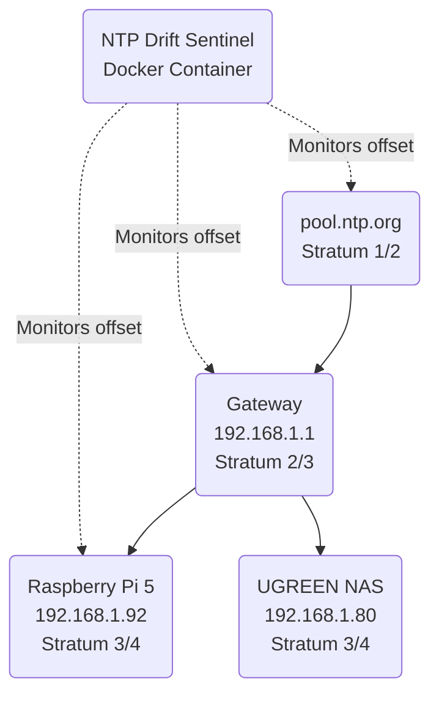

# Multi-Node NTP Clock Drift & PTP Time Synchronizer

Continuous clock drift and offset monitoring across Raspberry Pi 5 (192.168.1.92) and UGREEN NAS (192.168.1.80) to safeguard timestamp-sensitive distributed systems (Prometheus metrics, SQLite WAL replication, WireGuard handshakes).

## Architecture

This project runs an isolated containerized Python utility performing non-intrusive NTP queries via socket or ntplib.

### Clock Synchronization Topology



### Stratum Hierarchy

1. **Stratum 1**: Public time servers (e.g., GPS-backed or atomic clocks).
2. **Stratum 2**: `pool.ntp.org` servers querying Stratum 1.
3. **Stratum 3**: Local Gateway (`192.168.1.1`).
4. **Stratum 4**: Local edge devices (Raspberry Pi `192.168.1.92`, UGREEN NAS `192.168.1.80`).

## Prometheus Alerting Rules

A clock drift exceeding 50 milliseconds is flagged as an SLO warning.

```yaml
groups:
  - name: NTPDriftAlerts
    rules:
      - alert: HighClockDrift
        expr: homelab_ntp_drift_warning == 1
        for: 5m
        labels:
          severity: warning
        annotations:
          summary: "High Clock Drift detected on {{ $labels.server }}"
          description: "NTP Server {{ $labels.server }} has experienced a clock drift exceeding the 50ms threshold."
```

## Running the Service

You can build and start the NTP Sentinel using Docker Compose:

```bash
docker-compose up -d
```

The service exposes Prometheus metrics on port `9114`.

## CLI Usage

Run manually with Python:

```bash
python ntp_sentinel.py --check-now --servers 192.168.1.1 192.168.1.92 pool.ntp.org --threshold-ms 50
```
