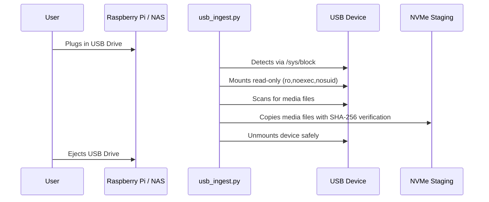

# Zero-Touch USB Drive Ingest & Media Auto-Mounter

Automated detection, safe read-only mounting, and media ingestion from USB flash drives and external SSDs plugged into Raspberry Pi 5 or UGREEN NAS.

## Architecture

This project consists of an isolated containerized Python utility (`usb_ingest.py`) that monitors block devices, mounts newly attached partitions as read-only, and ingests specific media files to an NVMe staging tier.

### Supported File Extensions

- `.mp4`
- `.mkv`
- `.jpg`
- `.cr3`
- `.flac`

### Ingestion Sequence

### Checksum Verification Runbook

To ensure data integrity, use the `--verify-hash` flag when running `usb_ingest.py`. The ingester calculates the SHA-256 hash of the source file and the copied destination file. If a mismatch occurs, it raises an error, leaving the process logged for review.
