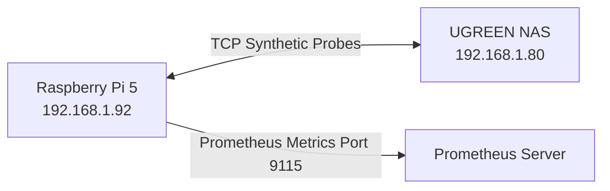

# Internal Speedtest Server & Bandwidth Saturation Sentry

Automated LAN/WAN throughput and latency monitoring, primarily built for testing connections between a Raspberry Pi 5 (192.168.1.92) and UGREEN NAS (192.168.1.80).

## Architecture & Bandwidth Test Topology

## Degradation Thresholds

The service detects local Ethernet link negotiation drops or saturation by comparing measured throughput against baseline thresholds.
- Default threshold: 800 Mbps for a 1GbE link.
- Can be configured to 1.8Gbps for 2.5GbE links via `--threshold-mbps`.

## Prometheus Metric Dictionary

| Metric Name | Type | Description |
|---|---|---|
| `homelab_network_bandwidth_mbps` | Gauge | Measured network throughput/bandwidth in Mbps. |
| `homelab_network_rtt_ms` | Gauge | Measured network round-trip time in milliseconds. |
| `homelab_network_link_degraded` | Gauge | 1 if the link is degraded (throughput < threshold), 0 otherwise. |
