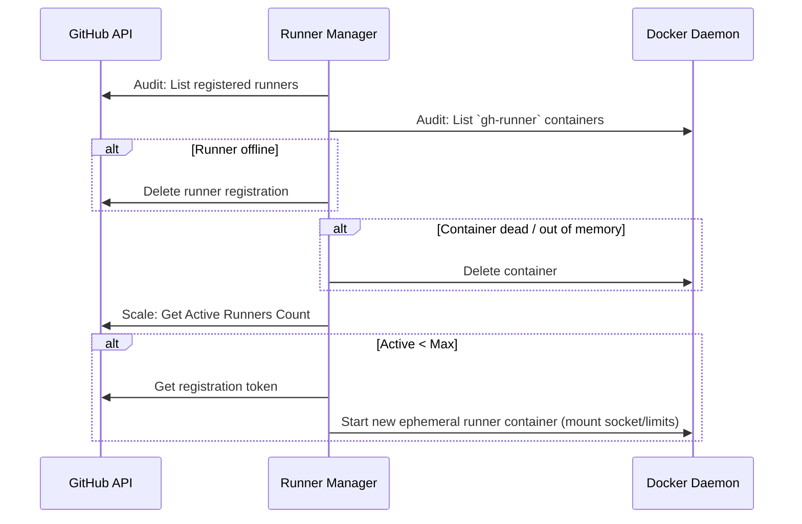

# Automated Homelab GitHub Actions Self-Hosted Runner Manager

A python tool for managing ephemeral self-hosted GitHub Actions runners in isolated Docker containers, specifically targeting a homelab environment (Raspberry Pi 5 and UGREEN NAS).

## Architecture



## Security Sandboxing

*   **Zero Host Mutation:** Interacts purely via the Docker daemon API socket (`/var/run/docker.sock`).
*   **Resource Protection:** Runners launch with strict memory limits (`1G`) and CPU quotas (`CPUQuota=50%`).
*   **Permissions:** Manager runs with read-only access to `/var/run/docker.sock` to prevent unwanted host modifications.

## GitHub API Registration Runbook

To use this tool, you must provide a valid `GITHUB_TOKEN` with permissions to manage runners for the repository.

1.  Create a Fine-Grained Personal Access Token (or a standard one with `repo` scope).
2.  Export it into your environment: `export GITHUB_TOKEN=github_pat_xxxx`
3.  Run the manager:
    ```bash
    python runner_manager.py --repo your_owner/your_repo --audit-now --max-runners 3
    ```

## Development

Run tests:
```bash
pytest tests/
```
