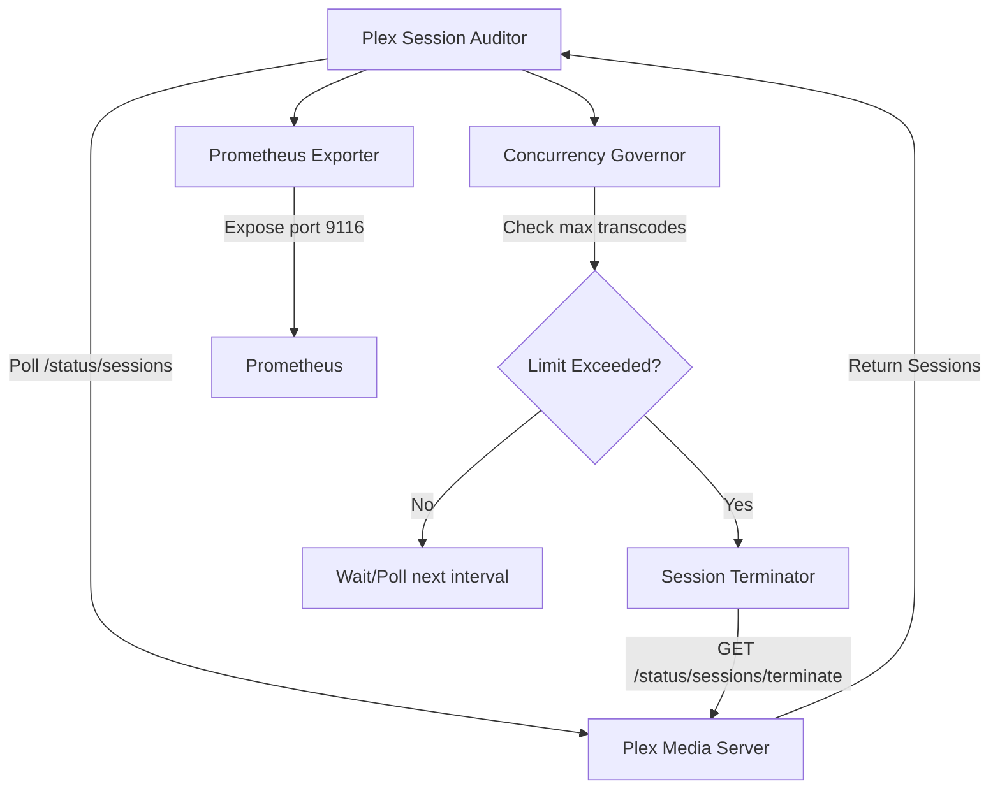

# Plex Stream Limiter

Plex Stream Concurrency & Bandwidth Throttler is a zero host mutation, containerized Python utility interacting via Plex REST API (`/status/sessions`). It guarantees CPU/iGPU headroom on a system (like UGREEN NAS Intel N100) by capping hardware transcodes, preventing excessive transcodes or authorized users from abusing WAN bandwidth.

## Architecture



## Hardware Limits & N100 Constraints

The Intel N100 processor features Quick Sync Video (QSV), which is highly capable but can easily run out of execution units (EU) or memory bandwidth when handling multiple 4K HDR transcodes. This service helps limit the total concurrent transcode streams (default: 2) to maintain host stability and ensure headroom for other containerized tasks.

## Prometheus Metrics

The service exports Prometheus metrics on port `9116`:
- `homelab_plex_active_streams_total`: Total number of active streams.
- `homelab_plex_transcodes_total`: Total number of transcoding streams.
- `homelab_plex_bandwidth_bps_total`: Estimated total bandwidth consumption (bps).

## Runbook / How To Run

Use Docker Compose to deploy the service in the background:

```bash
export PLEX_URL="http://192.168.1.80:32400"
export PLEX_TOKEN="your_plex_token_here"
export MAX_TRANSCODES=2

docker-compose up -d
```

### CLI Flags

You can also run the Python script locally to test or perform a one-off check:

```bash
pip install -r requirements.txt
python stream_limiter.py \
    --plex-url http://192.168.1.80:32400 \
    --plex-token mytoken \
    --max-transcodes 2 \
    --check-now \
    --dry-run \
    --json
```

- `--check-now`: Runs once and exits.
- `--dry-run`: Logs without actually terminating any streams.
- `--json`: Outputs logs in JSON format for easy parsing.
