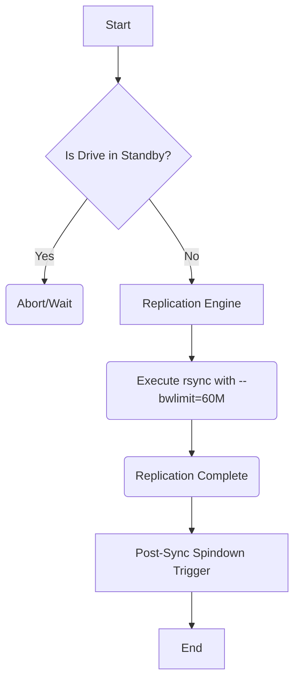

# Automated ZFS/Btrfs Replication to External Cold USB Storage

Automated snapshot replication and cold media sync from internal pools to external SMR USB 3.0 drives.
Features strict SMR bandwidth limiting to prevent buffer thrashing and respects drive standby states.

## Architecture Guide

## SMR Write-Cliff Protection
By using `--bwlimit=60M`, sequential single-stream writes are enforced. This prevents SMR shingled magnetic recording buffer thrashing.

## Udev Spindown Protocol
The script checks drive standby state before starting using `smartctl -n standby`. After replication completes, it triggers manual spindown using `hdparm -y` (or `sdparm --command=stop`) to enforce the 15-minute spindown policy.
