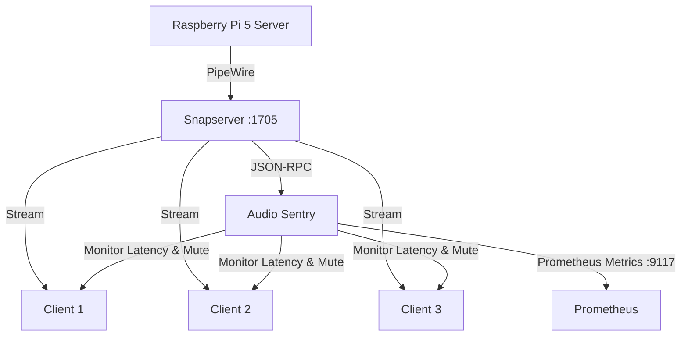

# Multi-Room Audio PipeWire/Snapcast Stream Sentry

This ecosystem utility manages and monitors low-latency multi-room audio streaming sessions across a Raspberry Pi 5 (acting as the Snapserver host, `192.168.1.92`) and network endpoints via the Snapcast/PipeWire JSON-RPC protocol (`:1705`).

## Architecture Topology



## Snapcast JSON-RPC Protocol

The Sentry interacts with the Snapserver via standard JSON-RPC over a TCP socket.
- It queries `Server.GetStatus` to inspect streams and client latency.
- It invokes `Client.SetVolume` to mute clients that exceed the synchronization threshold (>50ms deviation).

## Latency Synchronization Runbook

1. **Monitor**: Connects to the Snapserver and continually checks client `latency` attributes.
2. **Detect**: Identifies any client whose latency exceeds the configured threshold (`--max-latency-ms`, default 50ms).
3. **Mute**: Triggers a mute command to the desynced client to prevent echo/overlapping audio, logging the event.
4. **Metrics**: Exposes real-time Prometheus metrics on port 9117 (`homelab_snapcast_clients_connected`, `homelab_snapcast_client_latency_ms`, `homelab_snapcast_stream_active`).

## Usage

You can run the sentry directly:
```bash
python audio_sentry.py --host 192.168.1.92 --port 1705
```

Or via Docker Compose:
```bash
docker-compose up -d
```
