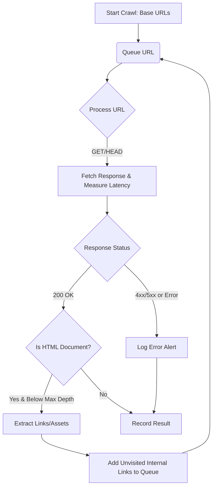

# Homelab Synthetic HTTP 4xx/5xx Broken Link & Asset Crawler

This ecosystem crawls internal homelab web applications (Pi-hole, Plex, Sonarr, Radarr, Audiobookshelf, Immich, Uptime Kuma) to detect dead links (HTTP 404), broken static assets (missing CSS/JS/images), internal server errors (500/502/504), and slow responses (>1000ms).

## Architecture

The crawler is an isolated containerized Python utility designed with non-intrusive probing directives:
- **Bounded Concurrency**: Max 3 concurrent requests (customizable).
- **Safe Probing**: Strictly GET/HEAD requests only, never submits forms.
- **Zero Host Mutation**.

### Mermaid Crawling Workflow

## Rate Limiting Safeguards
- Configurable concurrency (default `3`) implemented via Python's `ThreadPoolExecutor`.
- The crawler defaults to small execution batches to ensure no noticeable impact on running homelab applications.
- Timeouts are strictly enforced on all network requests to avoid hanging on unresponsive endpoints.

## Error Triage Runbook

When an error or alert is generated, consult the following guidelines:
- **4xx Dead Links (e.g., 404)**: Typically a missing asset or a broken hyperlink. Fix by either updating the source application's content or ensuring the static files are appropriately deployed.
- **5xx Internal Server Errors (e.g., 500, 502, 504)**: Represents backend issues on the homelab service. Check the respective application logs (e.g., Uptime Kuma, Plex) for tracebacks or misconfigurations.
- **Slow Responses (>1000ms)**: Could indicate database contention, network routing latency, or an overloaded service. Investigate host metrics (CPU/RAM).
