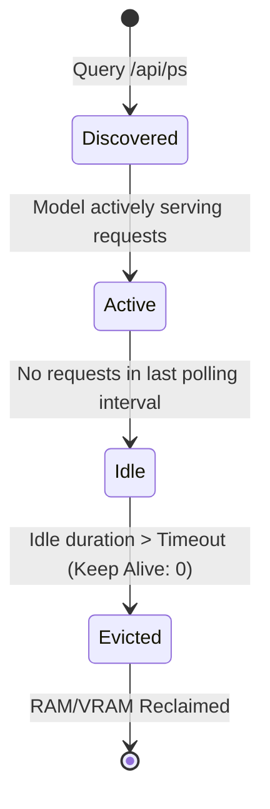

# Automated Ollama / Local LLM Model Cache & VRAM Governor

## Architecture Guide

This utility acts as a standalone governor to monitor local LLM inference engines (like Ollama) running across your network (e.g., Raspberry Pi 5, UGREEN NAS). It tracks memory usage and unloads models automatically based on an idle timeout to reclaim VRAM/RAM for other homelab services.

### Model Lifecycle

### Memory Governance Thresholds
- **Resource Limits**: The governor container itself runs with a hard memory limit of `128M`.
- **Idle Timeout**: The default idle eviction threshold is configurable.
- **Concurrency Throttling**: It intercepts excessive concurrent inference requests and rejects or queues new prompts to protect host memory.

### Ollama API Integration
- `GET /api/ps`: Used to discover loaded models.
- `GET /api/tags`: Used to discover available models.
- `POST /api/generate`: Used with `{"keep_alive": 0}` to unload idle models.

### Metrics Exporter
Exposes Prometheus metrics on port 9118:
- `homelab_llm_loaded_models`: Count of models currently loaded.
- `homelab_llm_memory_bytes`: Memory size for loaded models.
- `homelab_llm_idle_seconds`: Idle duration tracked per model.
