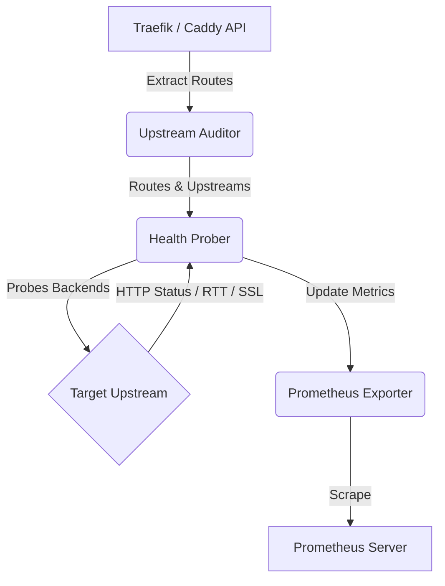

# Proxy Sentry

Dynamic Traefik / Caddy Reverse Proxy Upstream Sentry. Continuously probes internal reverse proxy routes (Traefik/Caddy) and backend upstreams. Detects orphaned frontend routes pointing to dead backend containers, missing TLS cert SANs, and 502 Bad Gateway regressions.

## Architecture

## Health Check Rules

*   **HTTP Status:** Evaluates if the HTTP response code is `< 500`. A code `< 500` is considered healthy (1), otherwise unhealthy (0).
*   **Latency (RTT):** Records the Round Trip Time for the HTTP request in seconds.
*   **SSL Certificate Validity:** Connects to the upstream using SSL and extracts the `notAfter` date from the certificate, calculating the number of days until expiry. Returns -1 if the connection fails or if there is no certificate.

## Prometheus Metric Index

Metrics are exposed on port `9119`.

*   `homelab_proxy_upstreams_healthy` (Gauge): Health status of upstream (1 for healthy, 0 for unhealthy). Labels: `host`, `upstream`.
*   `homelab_proxy_upstream_rtt_seconds` (Gauge): Response latency of upstream in seconds. Labels: `host`, `upstream`.
*   `homelab_proxy_upstream_ssl_expiry_days` (Gauge): Days until SSL certificate expiry. Labels: `host`, `upstream`.
