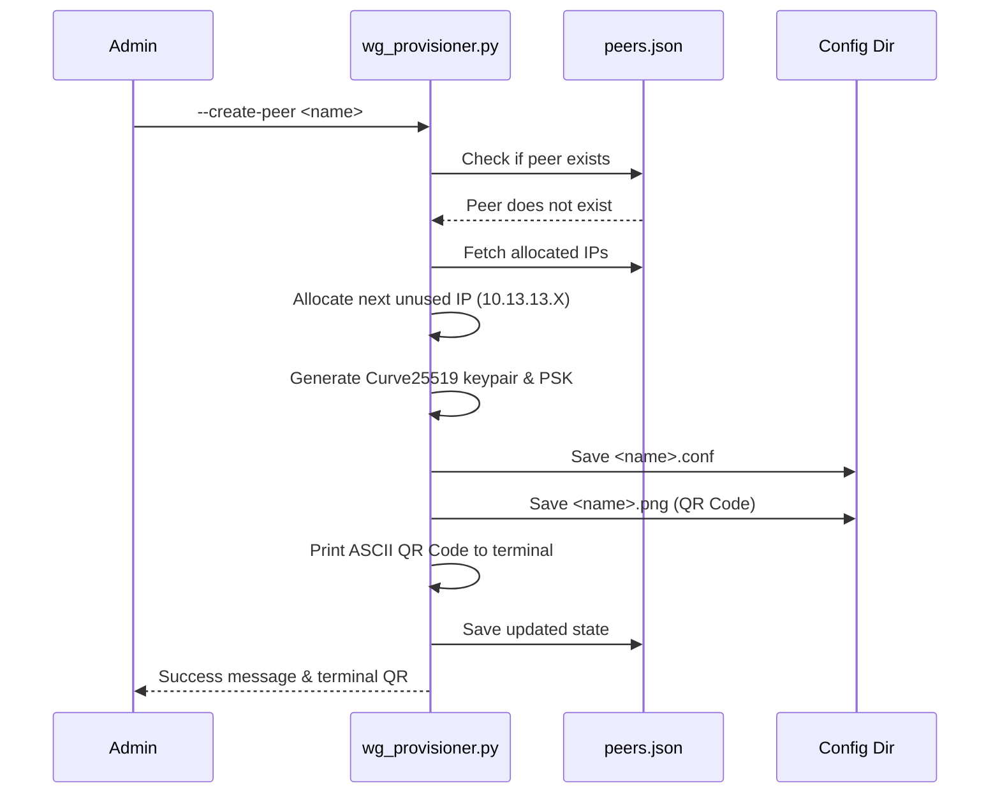

# Homelab Automated WireGuard Peer QR Code & Client Provisioner

## Architecture Guide

This project is an automated WireGuard peer generator and QR code provisioning CLI designed for secure remote access into a homelab network. It operates as an isolated, containerized Python utility that interacts exclusively with configuration files, adhering strictly to the **Zero Host Mutation** directive (it never modifies bare-metal host networking directly).

It performs the following key functions:
- Generates Curve25519 cryptographic keypairs.
- Allocates collision-free internal IPs within the `10.13.13.0/24` subnet.
- Produces client WireGuard configuration (`.conf`) files.
- Generates both terminal ASCII and exportable PNG QR codes for easy client onboarding.
- Maintains state in an isolated JSON file.

### Peer Onboarding Sequence



### Key Generation Runbook

1. **Curve25519 Keypair:** Uses the Python `cryptography` library to securely generate a new `X25519PrivateKey`. The public key is derived from this private key. Both are base64 encoded.
2. **Preshared Key (PSK):** Generates 32 bytes of secure random data (`os.urandom(32)`) and base64 encodes it to add an additional layer of post-quantum resistance to the WireGuard tunnel.
3. **Storage:** The generated private key and PSK are immediately written to the client configuration file and are *never* persisted to the central `peers.json` state (which only tracks public keys and assigned IPs).

### Client Configuration Schema

The generated WireGuard client configuration conforms to standard `.conf` format:

```ini
[Interface]
PrivateKey = <Base64 Client Private Key>
Address = 10.13.13.X/32
DNS = 10.13.13.1

[Peer]
PublicKey = SERVER_PUBLIC_KEY_PLACEHOLDER
PresharedKey = <Base64 Preshared Key>
Endpoint = vpn.example.com:51820
AllowedIPs = 0.0.0.0/0, ::/0
PersistentKeepalive = 25
```

> **Note:** The server's public key and endpoint address are currently stubbed in the script (`SERVER_PUBLIC_KEY_PLACEHOLDER` and `vpn.example.com:51820`). In a full deployment, these would be injected via environment variables or a global server configuration file.
