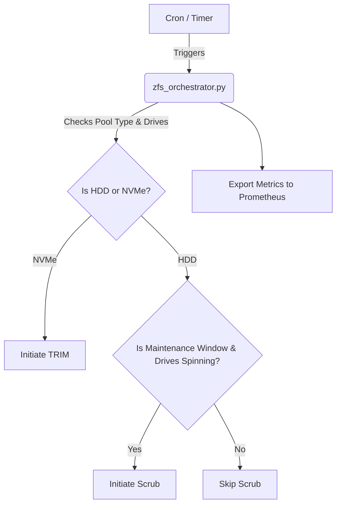

# Automated ZFS Snapshot Scrub & Trim Orchestrator

## Ecosystem Purpose
This project coordinates scheduled periodic TRIM operations on NVMe SSD pools (e.g., `/volume2`) and deep pool scrubs across homelab storage tiers on a UGREEN NAS (`192.168.1.80`).

## Storage Safeguards

1. **NVMe TRIM**: Runs SSD TRIM operations weekly to maintain NVMe write endurance and cell performance.
2. **Spindown Respect**: Mechanical HDD scrubs only run during maintenance windows (13:00-16:00) when drives are already spinning (`smartctl -n standby`).
3. **Zero Host Mutation**: Isolated containerized Python utility interacting via safe read-only commands and dry-run mode.

## Architecture & Storage Lifecycle



## Policies

- **TRIM**: Non-destructive, scheduled weekly on SSD/NVMe pools to maintain performance.
- **Scrub**: Evaluated before execution. Only runs during the maintenance window (13:00-16:00) and if the underlying drives are already actively spinning, avoiding unnecessary spin-ups.

## Prometheus Metrics & Alerting Rules

The container exposes metrics on port `9120`:
- `homelab_storage_trim_age_days`: Days since last TRIM.
- `homelab_storage_scrub_errors`: Number of scrub errors.
- `homelab_storage_scrub_progress_percent`: Current scrub progress (0-100%).

### Sample Alerting Rules

```yaml
groups:
- name: StorageAlerts
  rules:
  - alert: HighScrubErrors
    expr: homelab_storage_scrub_errors > 0
    for: 5m
    labels:
      severity: critical
    annotations:
      summary: "ZFS scrub errors detected on pool {{ $labels.pool }}"

  - alert: TrimNotRun
    expr: homelab_storage_trim_age_days > 7
    for: 24h
    labels:
      severity: warning
    annotations:
      summary: "TRIM has not run in over 7 days on pool {{ $labels.pool }}"
```
