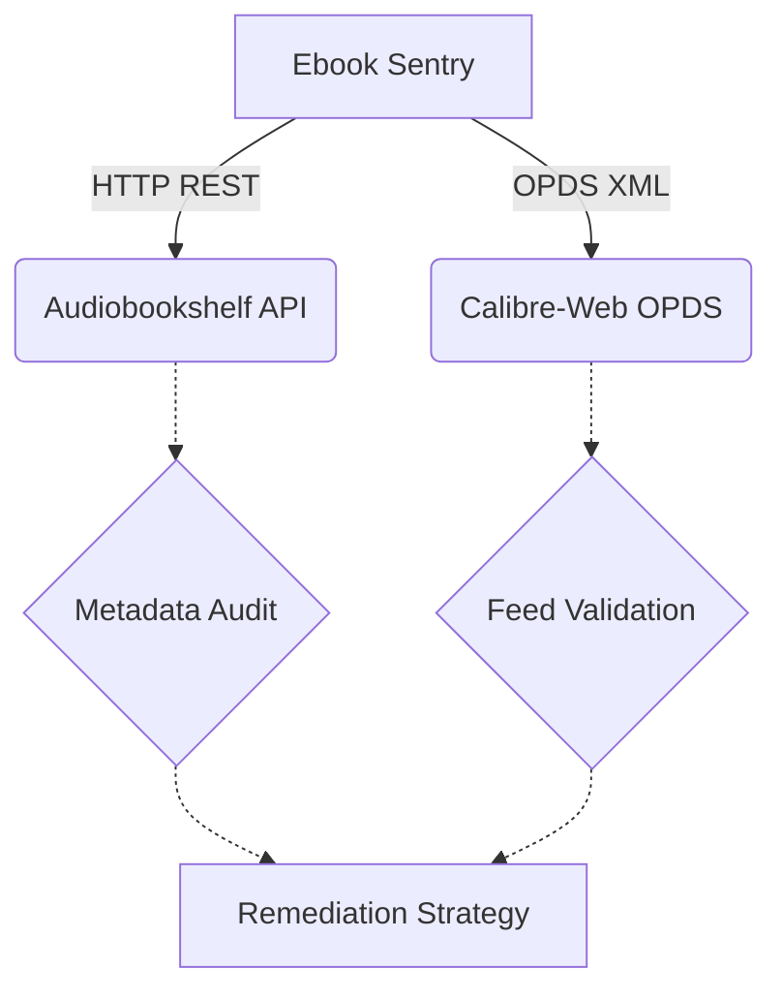

# Automated Audiobookshelf / Calibre Ebook Metadata & OPDS Sentry

This project acts as an ecosystem sentry for auditing and synchronizing ebook and audiobook collections across Audiobookshelf and Calibre-Web instances.

## Architecture

## OPDS Catalog Structure

Calibre-Web exposes its library via OPDS. The validation focuses on ensuring:
- Feed accessibility via HTTP GET.
- Valid XML syntax.
- The root element is correctly typed as an OPDS/Atom feed (`<feed>`).

## API Schema

### Audiobookshelf

Sentry utilizes the following Audiobookshelf REST API routes:

- `GET /api/libraries` - Returns an array of library objects, each with a unique `id`.
- `GET /api/libraries/{id}/items` - Returns the items in the specified library, detailing metadata such as:
  - `media.coverPath` / `media.hasCover`: Cover image presence.
  - `media.metadata.authors` / `media.metadata.authorName`: Author information.
  - `media.metadata.isbn`: Identifier structure.

### Sentry Execution Options

The tool provides the following CLI flags for execution mapping:

- `--audit-now`: Actively triggers an immediate evaluation audit across defined sources.
- `--abs-url <url>`: Defines the root URL path for the targeted Audiobookshelf instance.
- `--calibre-url <url>`: Defines the root URL path to the OPDS Calibre-Web catalog.
- `--dry-run`: Ensures the process avoids dispatching mutation queries back to underlying servers.
- `--json`: Formats diagnostic reports output into JSON.
