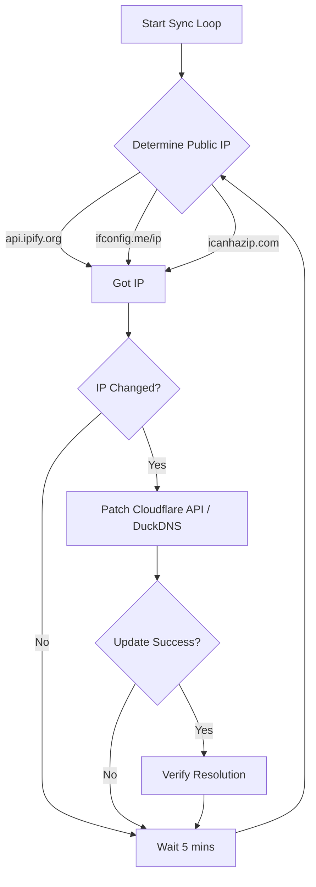

# DDNS Sentinel

Automated Homelab Dynamic DNS (Cloudflare / DuckDNS) Sentinel.

This project provides an automated external WAN IPv4/IPv6 address monitor and dynamic DNS synchronizer for Cloudflare API and DuckDNS. It detects ISP IP lease changes, updates DNS A records securely (with TTL=120), and verifies global resolution propagation using public resolvers.

## Features
- **Redundant IP Detection:** Queries multi-source WAN IP endpoints to avoid single points of failure.
- **Zero Host Mutation:** Isolated containerized Python utility.
- **Cloudflare and DuckDNS support**
- **Resolution Verification:** Confirms DNS record propagation globally.
- **Prometheus Metrics:** Exposes port 9121 for `homelab_ddns_ip_changed_total`, `homelab_ddns_sync_success`, and `homelab_ddns_propagation_verified`.

## Architecture Guide



## Cloudflare API Runbook
1. Generate an API Token from your Cloudflare dashboard with permissions to Edit DNS records for your Zone.
2. Obtain your Zone ID from the Cloudflare dashboard overview page for your domain.
3. Pass them as environment variables / command args.

## Running

With Docker Compose:
```bash
docker-compose up -d
```

Ensure you set `.env` with:
```
CLOUDFLARE_API_TOKEN=your_token
CLOUDFLARE_ZONE_ID=your_zone_id
DDNS_DOMAIN=your_domain.com
DUCKDNS_TOKEN=optional_duckdns_token
```

Or run locally once:
```bash
python ddns_sentinel.py --check-now --domain test.example.com --zone-id 123
```
