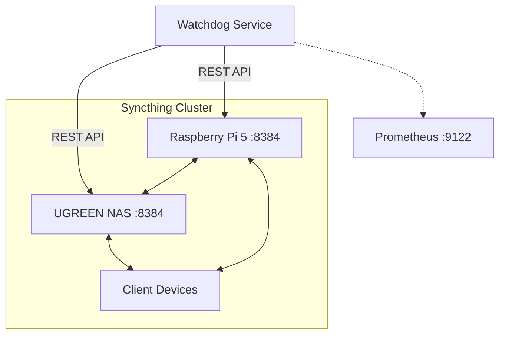

# Syncthing Conflict & Out-of-Sync Watchdog

Continuously monitors Syncthing clusters across devices (e.g., Raspberry Pi 5, UGREEN NAS, client devices) via Syncthing REST API (:8384).

Automatically detects:
* `.sync-conflict-*` files
* Stuck sync transfers
* Disconnected cluster devices
* Database folder errors

## Storage Safeguards

*   **Spindown Respect:** Scans conflicts via Syncthing database API without performing recursive disk crawling on mechanical HDDs (e.g., `/volume1`).
*   **Zero Host Mutation:** Isolated containerized Python utility.

## Architecture



## Conflict Resolution Rules

1. Identify conflicts using `db/browse` via API instead of disk IO.
2. Alert if any devices are disconnected.
3. Monitor completion ratios to detect stuck syncs.

## API Documentation
The script queries the following endpoints:
* `/rest/system/status`: Overall status
* `/rest/db/completion`: Completion ratio for a device and folder
* `/rest/system/connections`: Lists active connections
* `/rest/db/ignores`: Retrieves folder ignores
* `/rest/db/browse`: Queries folder tree directly from DB

## Usage
Run directly:
```bash
python syncthing_watchdog.py --api-url http://<syncthing-ip>:8384 --api-key <your-api-key>
```
Or via Docker Compose (using Prometheus to scrape port 9122).
