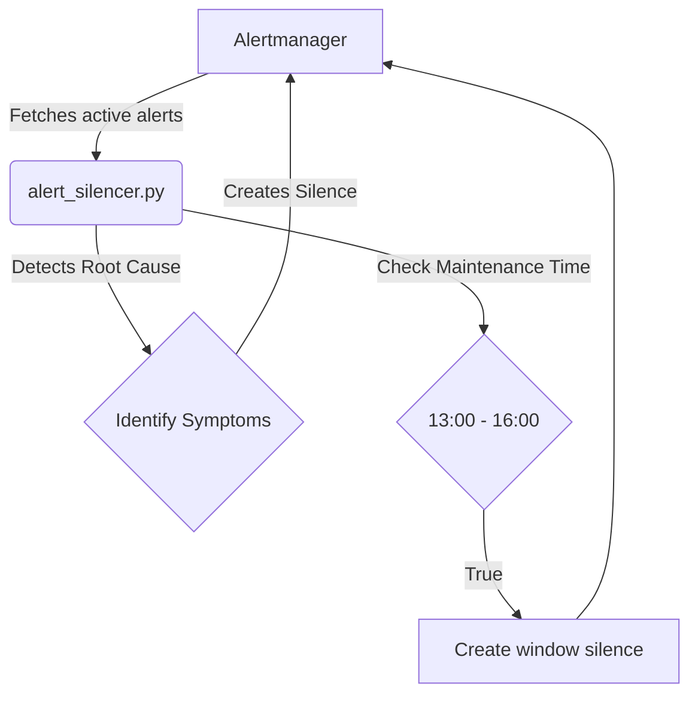

# Homelab Prometheus Alertmanager Deduplicator & Silencer

This project serves as an isolated Python utility alongside Prometheus Alertmanager to handle alert storms and schedule maintenance window silences. It protects against alert fatigue by suppressing symptom alerts when a known root cause alert is detected.

## Features

- **Maintenance Silence Coordinator:** Automatically creates time-bounded silences via Alertmanager API during scheduled maintenance windows (13:00-16:00).
- **Storm Deduplicator:** Correlates root-cause alerts (e.g. `HostReboot`, `UPSOnBattery`) and creates short-lived silences to suppress downstream symptom alerts.
- **Prometheus Metrics:** Exposes metrics on port `9123` (`homelab_silences_active_total`, `homelab_alert_storm_detected`, `homelab_deduplicated_alerts_total`).

## Architecture

The script uses Alertmanager's v2 REST API to fetch current active alerts and create matching silences to deduplicate symptoms.

## Maintenance Window Rules

The maintenance window is strictly evaluated between **13:00 and 16:00** based on local system time. The silence is created to last until exactly 16:00 of the same day.

## Integration

The tool interacts directly with the Alertmanager API (typically on port `:9093`).

### CLI Options

- `--check-now`: Run one-off check for active maintenance windows and active alert storms, rather than running a continuous process.
- `--alertmanager-url <url>`: Override the default Alertmanager API URL (defaults to `http://localhost:9093`).
- `--create-window-silence`: Force check/creation of maintenance silences.
- `--dry-run`: Evaluate alerts but avoid making HTTP POST requests to create silences.
- `--json`: Format logging output as JSON strings for log aggregators.
