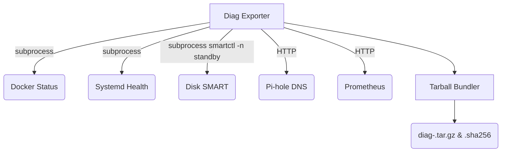

# Homelab Automated Health Check & Diagnostic Bundle Exporter

Orchestrates comprehensive cluster-wide diagnostic health audits across Raspberry Pi 5 (192.168.1.92) and UGREEN NAS (192.168.1.80).

## Architecture & Topology



## Storage & Spindown Safeguards
- **Spindown Respect:** Disk state is queried strictly using `smartctl -n standby` to ensure sleeping mechanical HDDs (e.g., `/volume1`) are NOT woken up.
- **Zero Host Mutation:** The tool is a containerized Python utility completely isolated from mutating the host environment.

## Usage
Run via docker-compose:
```bash
docker-compose up
```

Run directly:
```bash
python diag_exporter.py --help
python diag_exporter.py --collect-now --output-dir /tmp/bundles
```

### CLI Flags
- `--collect-now`: Run data collection immediately
- `--output-dir <path>`: Output directory for the diagnostic bundle
- `--dry-run`: Print what would be done without modifying anything
- `--json`: Output collection result as JSON to stdout

## Bundle Inspection Runbook
1. Locate the generated `diag-<timestamp>.tar.gz` and `diag-<timestamp>.sha256` files.
2. Verify integrity: `sha256sum -c diag-<timestamp>.sha256`
3. Extract the contents: `tar -xzf diag-<timestamp>.tar.gz`
4. Inspect `metrics.json` inside the extracted folder for statuses of `docker`, `systemd`, `pihole`, `prometheus`, and `storage`.
